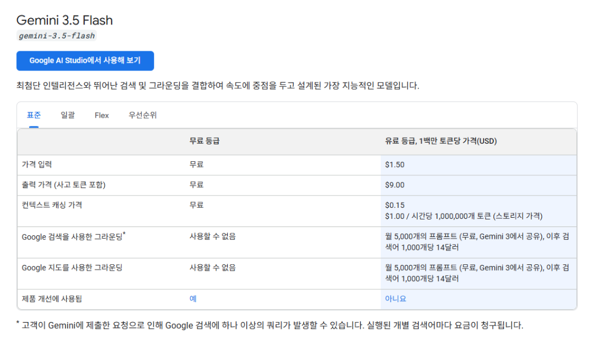
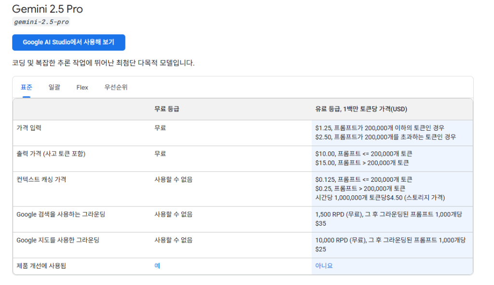
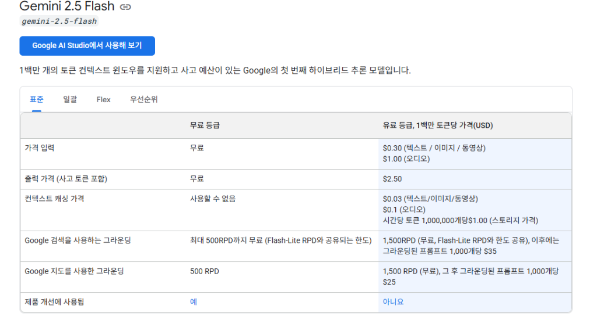
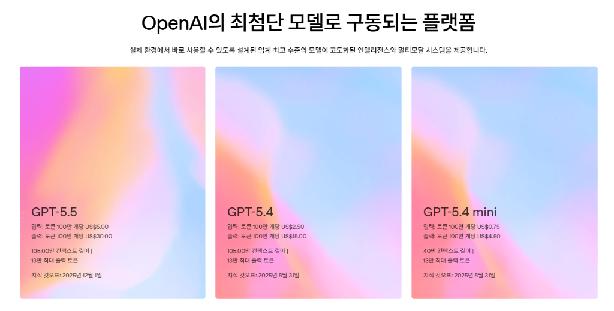
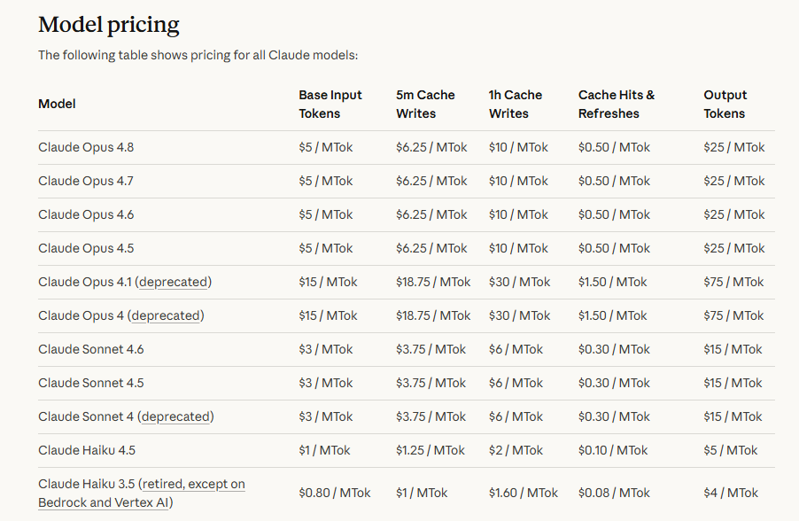

# LLM API 모델별 가격 및 운영 비용 비교

이 문서는 프로젝트의 AI 분석 기능(Phase 2 및 Phase 2.5) 운영을 위해 주요 LLM API의 토큰 단가와 실제 시나리오별 예상 비용을 정리한 문서입니다.

* **환율 기준**: 1달러($) = 1,500원
* **토큰 기준**: 1M = 100만 토큰
* **참고 자료**: 각 API 제공사별 단가표 이미지 (본 폴더에 동시 보관)

---

## 1. LLM API 모델별 토큰 단가 (1M 토큰당 가격)

| 제공사 | 모델명 | 입력 단가 (per 1M) | 출력 단가 (per 1M) |
| :--- | :--- | :--- | :--- |
| **Google** | **Gemini 2.5 Flash** | \$0.30 | \$2.50 |
| | **Gemini 2.5 Pro** (<= 200k) | \$1.25 | \$10.00 |
| | **Gemini 3.5 Flash** | \$1.50 | \$9.00 |
| **OpenAI** | **GPT-5.4 mini** | \$0.75 | \$4.50 |
| | **GPT-5.4** | \$2.50 | \$15.00 |
| | **GPT-5.5** | \$5.00 | \$30.00 |
| **Anthropic** | **Claude Haiku 4.5** | \$1.00 | \$5.00 |
| | **Claude Sonnet 4.6** | \$3.00 | \$15.00 |
| | **Claude Opus 4.8** | \$5.00 | \$25.00 |

---

## 2. 시나리오별 예상 운영 비용

### 시나리오 A: 매장 1개 분석 (최근 게시물 30개 기준)
* **소모 토큰 가정**: **입력 11,000 tokens** (0.011M) / **출력 8,000 tokens** (0.008M)
* **내용**: 30개 게시물의 캡션 텍스트 및 수치 메타데이터 분석 후 JSON 마케팅 인사이트 추출

| 모델명 | 계산식 (USD) | 총 비용 (USD) | 원화 환산 비용 (1,500원) |
| :--- | :--- | :--- | :--- |
| **Gemini 2.5 Flash** | $(0.011 \times 0.30) + (0.008 \times 2.50)$ | \$0.02330 | **약 35.0원** |
| **GPT-5.4 mini** | $(0.011 \times 0.75) + (0.008 \times 4.50)$ | \$0.04425 | **약 66.4원** |
| **Claude Haiku 4.5** | $(0.011 \times 1.00) + (0.008 \times 5.00)$ | \$0.05100 | **약 76.5원** |
| **Gemini 3.5 Flash** | $(0.011 \times 1.50) + (0.008 \times 9.00)$ | \$0.08850 | **약 132.8원** |
| **Gemini 2.5 Pro** | $(0.011 \times 1.25) + (0.008 \times 10.00)$ | \$0.09375 | **약 140.6원** |
| **GPT-5.4** | $(0.011 \times 2.50) + (0.008 \times 15.00)$ | \$0.14750 | **약 221.3원** |
| **Claude Sonnet 4.6** | $(0.011 \times 3.00) + (0.008 \times 15.00)$ | \$0.15300 | **약 229.5원** |
| **Claude Opus 4.8** | $(0.011 \times 5.00) + (0.008 \times 25.00)$ | \$0.25500 | **약 382.5원** |
| **GPT-5.5** | $(0.011 \times 5.00) + (0.008 \times 30.00)$ | \$0.29500 | **약 442.5원** |

---

### 시나리오 B: 매장 4개 비교 분석 (요약 통계 기반)
* **소모 토큰 가정**: **입력 1,000 tokens** (0.001M) / **출력 1,600 tokens** (0.0016M)
* **내용**: 이미 가공된 4개 매장의 지표 요약(소구점, 톤, 키워드 등)을 비교하여 종합 진단 리포트 생성

| 모델명 | 계산식 (USD) | 총 비용 (USD) | 원화 환산 비용 (1,500원) |
| :--- | :--- | :--- | :--- |
| **Gemini 2.5 Flash** | $(0.001 \times 0.30) + (0.0016 \times 2.50)$ | \$0.00430 | **약 6.5원** |
| **GPT-5.4 mini** | $(0.001 \times 0.75) + (0.0016 \times 4.50)$ | \$0.00795 | **약 11.9원** |
| **Claude Haiku 4.5** | $(0.001 \times 1.00) + (0.0016 \times 5.00)$ | \$0.00900 | **약 13.5원** |
| **Gemini 3.5 Flash** | $(0.001 \times 1.50) + (0.0016 \times 9.00)$ | \$0.01590 | **약 23.9원** |
| **Gemini 2.5 Pro** | $(0.001 \times 1.25) + (0.0016 \times 10.00)$ | \$0.01725 | **약 25.9원** |
| **GPT-5.4** | $(0.001 \times 2.50) + (0.0016 \times 15.00)$ | \$0.02650 | **약 39.8원** |
| **Claude Sonnet 4.6** | $(0.001 \times 3.00) + (0.0016 \times 15.00)$ | \$0.02700 | **약 40.5원** |
| **Claude Opus 4.8** | $(0.001 \times 5.00) + (0.0016 \times 25.00)$ | \$0.04500 | **약 67.5원** |
| **GPT-5.5** | $(0.001 \times 5.00) + (0.0016 \times 30.00)$ | \$0.05300 | **약 79.5원** |

---

## 3. 요약 및 운영 제안

1. **상시 인스타그램 개별 매장 분석 (시나리오 A)**
   * 분석 대상 매장의 캡션을 한 개씩 분석하는 것은 전체적인 텍스트량이 매우 크기 때문에 상시 호출 시 비용이 쉽게 누적될 수 있습니다.
   * 가성비와 속도가 최우선인 상시 분석에는 **Gemini 2.5 Flash** (회당 약 35원) 또는 **GPT-5.4 mini** (회당 약 66원)를 사용하는 것이 절대적으로 권장됩니다.

2. **종합 비교 리포트 진단 (시나리오 B)**
   * 비교 분석은 계정당 게시물을 전부 다시 읽는 것이 아니라, 1차 가공된 데이터(예: '정보성 캐러셀 30%', '소구점: 상품 장점 강조 5회' 등)만 활용하여 비교하기 때문에 입력 토큰의 크기가 매우 작습니다.
   * 따라서 이 단계에서는 비용 부담이 거의 없으므로 고성능 추론 모델인 **Claude Sonnet 4.6** (회당 약 40원) 혹은 **Gemini 2.5 Pro** (회당 약 26원)를 하이브리드로 채택하여 고품질의 통찰력을 얻는 것이 유리합니다.

---

## 4. 첨부 단가표 이미지

### Google Gemini 단가표
* **Gemini 3.5 Flash**: 
* **Gemini 2.5 Pro**: 
* **Gemini 2.5 Flash**: 

### OpenAI GPT-5 단가표
* **GPT-5 계열**: 

### Anthropic Claude 단가표
* **Claude 계열**: 
